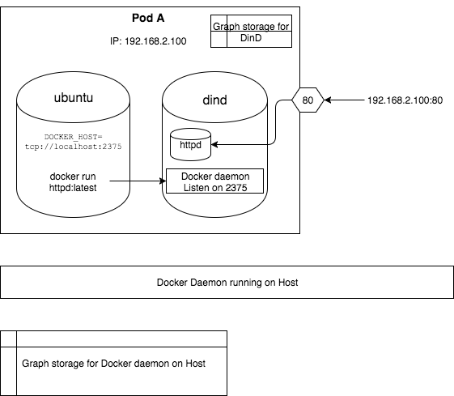
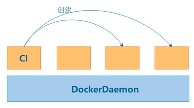

## dind

## dood

## 参考

- [GitLab-Runner配置参数详解](https://www.jianshu.com/p/6decaed7b648)
- [在gitlabCI中构建docker镜像DinD和DooD](https://www.ipcpu.com/2022/03/gitlab-ci-dind-dood/)
- [Gitlab持续集成中Dood与Dind应该怎么玩？](https://cloud.tencent.com/developer/article/1737663)
- [高级配置¬-gitlab runner 配置项](https://docs.gitlab.cn/runner/configuration/advanced-configuration.html)